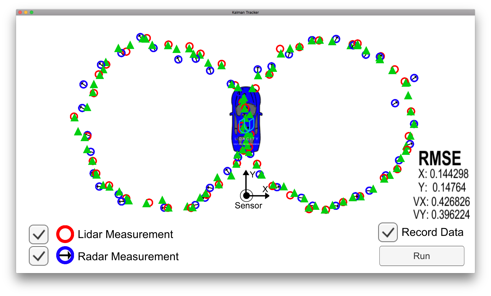
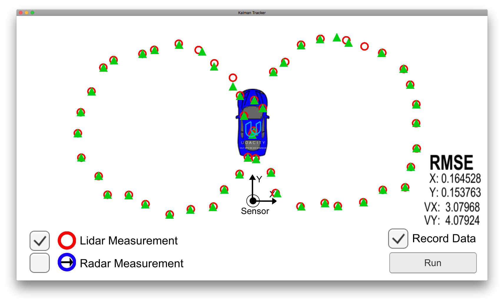
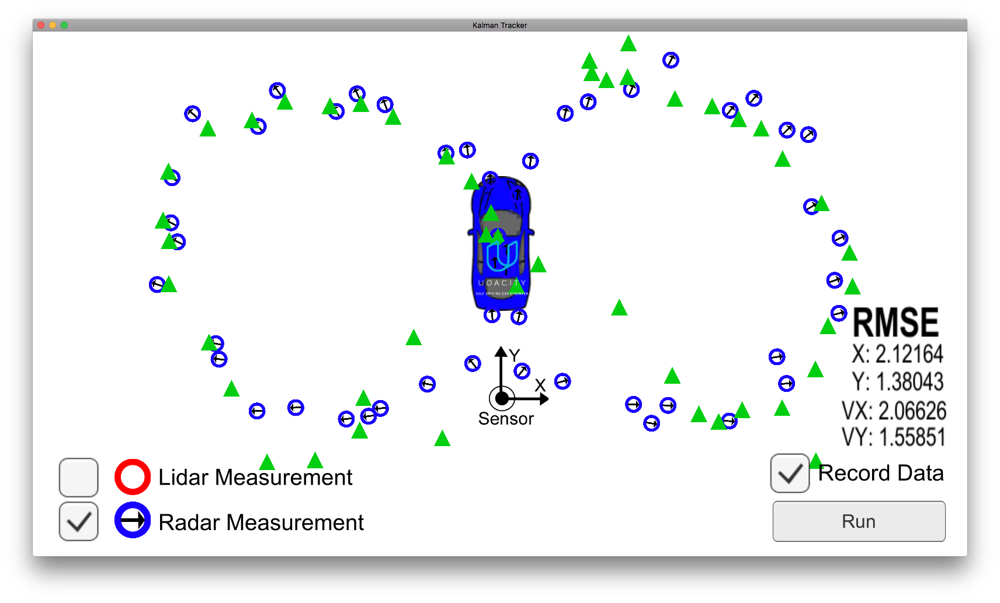

# Unscented Kalman Filter Project #

This project is originally forked from https://github.com/udacity/CarND-Unscented-Kalman-Filter-Project.  This repository includes starter code, that is used herein.

## Initialization ##

As with the EKF case, there are two possibilities for initializing the state estimate, depening on which sensor provides the initial measurement.

If the first available measurement comes from the lidar sensor, then the initialization is simple.  We simply take the measured `x` and `y` positions as the initial values for `px` and `py`, and assume `v`, `phi` and `phi_dot`  are initially `0.0`.

If the first available measurement comes from the radar sensor, then we need to convert the polar coordinates `rho` and `phi` into Cartesian coordinates.  Unfortunately, we don't know the direction of `rho_dot`, so we can't use this information to initialize `vx` or `vy`.  Like the lidar case, assume `v`, `phi` and `phi_dot` are initially `0.0`.  The helper function `Polar2Cartesian()` is implemented in tools.cpp to improve readability in the main UKF process.

In either case we take not to initialize the position `sqrt(px^2 + py^2)` too near `0.0`, as this value is used in division operations, and a relative position of `0.0` does not make sense physically; and object must be some minimum distance away from the measurement device.

The initial timestep `time_us_` must also be set, in order to calculate the time difference `dt` in later steps.

*From ukf.cpp*
```C++
// initialize time and CTRV state
time_us_ = meas_package.timestamp_;
x_.fill(0.0);
    
// populate CTRV state initial value with measurement data
if (meas_package.sensor_type_ == MeasurementPackage::RADAR) {
  // check for rho not too near 0.0
  if (meas_package.raw_measurements_(0) > 0.001){
    x_ = tools.Polar2Cartesian(meas_package.raw_measurements_);
  } else {
  // default values if first measurement is close to rho = 0.0
    x_(0) = 0.1;
    x_(1) = 0.1;
  }
}
else if (meas_package.sensor_type_ == MeasurementPackage::LASER) {
  // check for (x,y) not too near (0.0, 0.0)
  if ((fabs(meas_package.raw_measurements_(0) > 0.1)) || fabs((meas_package.raw_measurements_(1)) > 0.1)) {
    x_(0) = meas_package.raw_measurements_(0);
    x_(1) = meas_package.raw_measurements_(1);
  } else {
    // default values if first measurement is close to (x, y) = (0.0, 0.0)
    x_(0) = 0.1;
    x_(1) = 0.1;
  }
}
```

## Predicted Measurement ##

The prediction step is a simple one, that is taken directly from the lesson materials.  The helper functions `GenSigmaPts()`, `PredSigmaPts()`, `PredMean()` and `PredCovariance()` are implemented in tools.cpp in order to make the main UKF process more readable.  Moreover, `PredMean()` and `PredCovariance()` can be reused in the measurement update step for radar.  The final argument in an index of the angle `phi`, so that the angle normalization is properly handled for both the state estimate `x_` and measurement `z` update steps.

*From ukf.cpp*
```C++
void UKF::Prediction(double delta_t) {
  
  MatrixXd Xsig_aug(n_aug_, n_sig_);
  
  // Clear previous sigma points and prediction
  Xsig_aug.fill(0.0);
  Xpred_.fill(0.0);
  
  // Generate and predict sigma points
  tools.GenSigmaPts(Xsig_aug, x_, P_, std_a_, std_yawdd_, lambda_, n_x_, n_aug_);
  tools.PredSigmaPts(Xpred_, Xsig_aug, delta_t, n_x_, n_aug_);
  
  // Predict mean and covariance
  tools.PredMean(x_, Xpred_, weights_);
  tools.PredCovariance(P_, x_, Xpred_, weights_, CTRVPHIIDX);
}
```

## Lidar Updates ##

For lidar measurements, the update step can use the same process as the EKF case.  The relationship between state estimate `x_` and measurement `z` is linear.

As recommended in the review of my first project submission, I have pulled the calculation of matrix `PHt` into a separate line of code, in order to reduce the number of matrix multiplication operations.

*From ukf.cpp*
```C++
void UKF::UpdateLidar(MeasurementPackage meas_package) {
  
  // Use implementation from EKF (linear function)
  MatrixXd H(n_lidz_, n_x_);
  MatrixXd R(n_lidz_, n_lidz_);
  VectorXd z(n_lidz_);
  MatrixXd I = MatrixXd::Identity(n_x_, n_x_);
  
  // Linear x -> z transformation matrix
  H << 1, 0, 0, 0, 0,
       0, 1, 0, 0, 0;
  
  // Measurement noise covariance matrix
  R << std_laspx_*std_laspx_, 0,
       0, std_laspy_*std_laspy_;
  
  // Get measurement data
  z << meas_package.raw_measurements_(0), meas_package.raw_measurements_(1);
  
  // Measurement prediction
  VectorXd z_pred = H * x_;
  
  // Prediction error
  VectorXd y = z - z_pred;
  
  // Update state vector andc covariance matrix
  MatrixXd PHt = P_ * H.transpose();
  MatrixXd S = H * PHt + R;
  MatrixXd K = PHt * S.inverse();
  x_ = x_ + (K * y);
  P_ = (I - K * H) * P_;
}
```

## Radar Updates ##

The relationship between the state estimate `x_` and measurement `z` is nonlinear, so we need to use sigma points for this update step.  Nonlinear equations are implemented directly, there is no need to calculate linear approximations by way of Jacobian matrices.  The helper function `Cartesian2Polar()` is implemented in tools.cpp to improve the main UKF process readability.  This function takes a matrix of sigma points in the state estimate space `X` and converts them to the measurement space `Z` one-by-one.  Asmentioned above, the functions `PredMean()` and `PredCovariance()` are reused here, but they act on predicted sigma points in the `Z` domain to calculate the predicted measurement `z_pred` and measurement covariance matrix `S`.

*From ukf.cpp*
```C++
void UKF::UpdateRadar(MeasurementPackage meas_package) {
  MatrixXd Zpred(n_radz_, n_sig_);
  MatrixXd S(n_radz_, n_radz_);
  MatrixXd R(n_radz_, n_radz_);
  VectorXd z(n_radz_);
  VectorXd z_pred(n_radz_);
  MatrixXd Tc = MatrixXd(n_x_, n_radz_);
  VectorXd x_err(n_x_);
  VectorXd z_err(n_radz_);
  MatrixXd K(n_x_,n_radz_);
  Tc.fill(0.0);
  Zpred.fill(0.0);
  S.fill(0.0);
  
  // Get measurement data
  z << meas_package.raw_measurements_(0),
       meas_package.raw_measurements_(1),
       meas_package.raw_measurements_(2);
  
  // Measurement noise covariance matrix
  R << std_radr_*std_radr_, 0 ,0,
       0, std_radphi_*std_radphi_, 0,
       0, 0, std_radrd_*std_radrd_;
  
  // Transform predicted sigma points into measurement space Xpred -> Zpred
  tools.Cartesian2Polar(Xpred_, Zpred, n_sig_);
  
  // Predict mean and covariance
  tools.PredMean(z_pred, Zpred, weights_);
  tools.PredCovariance(S, z_pred, Zpred, weights_, RADPHIIDX);
  S += R;
  
  // From lesson 29
  for (int i = 0; i < n_sig_; ++i) {
    // distance between predicted sigma point and mean
    x_err = Xpred_.col(i)-x_;
    z_err = Zpred.col(i)-z_pred;
    
    //angle normalization (-pi, pi) in x and z domains
    while (x_err(CTRVPHIIDX)> M_PI) x_err(CTRVPHIIDX) -= 2.*M_PI;
    while (x_err(CTRVPHIIDX)<-M_PI) x_err(CTRVPHIIDX) += 2.*M_PI;
    while (z_err(RADPHIIDX)> M_PI) z_err(RADPHIIDX) -= 2.*M_PI;
    while (z_err(RADPHIIDX)<-M_PI) z_err(RADPHIIDX) += 2.*M_PI;
    
    Tc = Tc + weights_(i)*x_err*z_err.transpose();
  }
  
  //calculate Kalman gain K;
  K = Tc*S.inverse();
  
  // Update state mean and covariance matrix (reuse z_err)
  z_err = z-z_pred;
  
  //angle normalization (-pi, pi) in z domain
  while (z_err(RADPHIIDX)> M_PI) z_err(RADPHIIDX)-=2.*M_PI;
  while (z_err(RADPHIIDX)<-M_PI) z_err(RADPHIIDX)+=2.*M_PI;
  
  x_ += K*(z-z_pred);
  P_ -= K*S*K.transpose();
```
#### Note ####

In order to run kalman_tracker.py with only the radar data, I had to add intermediate predict steps in order to maintain numerical stability.  This was suggested [here](https://discussions.udacity.com/t/numerical-instability-of-the-implementation/230449/3).  This was not necessary to run the basic test datafiles.

*From ukf.cpp
```C++
// handle large delta t to keep predictions numerically stable
while (dt > 0.1)
{
  const double dt_small = 0.05;
  Prediction(dt_small);
  dt -= dt_small;
}
```

## Performance ##

Two datafiles are provided to evaluate the accuracy for the final UKF.  Note that a third data file ([sample-laser-radar-measurement-data-2.txt](data/sample-laser-radar-measurement-data-2.txt)) is also provided, but due to complications with numerical instability, this is not assessed.
1. [sample-laser-radar-measurement-data-1.txt](data/sample-laser-radar-measurement-data-1.txt)
2. [obj_pose-laser-radar-synthetic-input.txt](data/obj_pose-laser-radar-synthetic-input.txt)

My UKF implementation satisfies the rubric accuracy criteria for both datasets.  For the case of *obj_pose-laser-radar-synthetic-input.txt* the results are greatly improved with the UKF when compared to the EKF.

As expected, the UKF model performs as well or better than the EKF for the provided test data.  In the case of datafile [obj_pose-laser-radar-synthetic-input.txt](data/obj_pose-laser-radar-synthetic-input.txt), the RMSE for `vy` improves by a factor of 7!

#### RMSE for sample-laser-radar-measurement-data-1.txt ####

|State |RMSE UKF |RMSE EKF |RMSE Limit                     
|:-----|:--------|:--------|:---------
|`px` |0.053 |0.065 |0.090 
|`py` |0.064 |0.062 |0.090 
|`vx` |0.529 |0.544 |0.650 
|`vy` |0.547 |0.544 |0.650 

#### RMSE for obj_pose-laser-radar-synthetic-input.txt ####

|State |RMSE UKF |RMSE EKF |RMSE Limit                     
|:-----|:--------|:--------|:---------
|`px` |0.073 |0.140 |0.090 
|`py` |0.085 |0.665 |0.100 
|`vx` |0.357 |0.579 |0.400 
|`vy` |0.244 |1.634 |0.300 

### NIS ###

*Add NIS evaluation and sensitivity to process noise tuning*
*Add NIS visualizations*

## Performance Visualization ##

The results from the Kalman Tracker visualization tool are shown below.  As expected, the case where both sensors are used via UKF fusion scheme produces much better results than either case with a single sensor.  Interestingly, a modification, above, was necessary to successfully run the tool with only radar data.  Else the software eventually become stuck (presumably in a while loop with diverging numerical results).

In the case of lidar only, the velocity components of the state vector are an order of magnitude worse than with sensor fusion.

In the case of radar only, the positions components of the state vector are an order of magnitude worse, and the velocity components are about 5x worse.


*Results using both sensors*


*Results using only lidar*


*Results using only radar*

## Reflections ##

Near the end of my implementation I was not getting satisfactory results for RMSE, although the whole process flow was completed.  I spent a great deal of time checking and double-checking each step.  In the end, I simply had calculated the timestep `dt` backward, i.e. it was a negative number.  This simple mistake cost me a lot of time, and was difficult to pin down.  In the future I'll be sure to print more intermediate calculations out to the terminal during the implementation phase.  Seeing a negative value in the `dt` would easily raise a red flag had I done this.

My method for normalizing angles between `-pi` and `pi` is taken directly from the lessons material.  However, early on, this function would become stuck in an infinite `while()` loop, as the estimates diverged.  While this only manifested due to running incomplete code, it still may not be a robust solution.  A modulo (`%`) operation should be able to give the same results without the risk of critical failure. 

Like the first project in the second term, this project is mainly an exercising in copying/moving code from the lesson material into the provided starter code.
